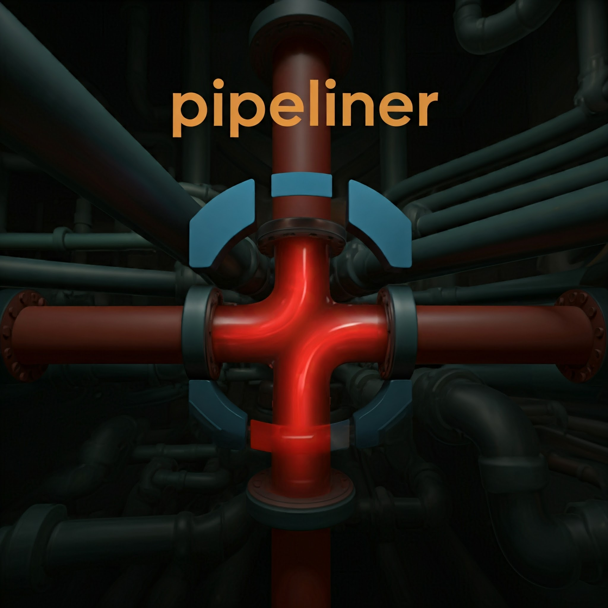

# Pipeliner - Blender Add-on

**Pipeliner** is a powerful Blender add-on designed to streamline and automate your workflow by simplifying tasks like importing models, managing file structures, and referencing project assets. This tool helps you focus more on creativity and less on manual tasks.

## Features

- 📥 **Automated Importing**: Automatically import models from compressed files (e.g., `.zip`, `.rar`, `.7z`) and add them directly to your Blender scene.
- 🔘 **Model Buttons**: After extraction, it creates a button in the UI to quickly import the model into your scene with just one click.
- 🖼️ **PureRef Integration**: Manage and open PureRef files with references saved directly in your project folder.
- 📁 **Folder Structure Creation**: Automatically generate a well-organized folder structure for your projects with one click.
- ✔️ **Task Management**: Built-in to-do list feature to help track tasks directly in Blender.
- 🔄 **Version Control System**: Save and manage different instances of your Blender files with a simple UI. This feature allows users to commit versions, revert to previous states, and manage changes easily.

## Installation

1. Download the latest version of the Pipeliner add-on from this repository.
2. In Blender, go to `Edit > Preferences > Add-ons > Install`.
3. Select the `.zip` file of the add-on and click `Install Add-on`.
4. Enable the add-on in the preferences window.

## Usage

1. 🏗️ **Create Project Structure**: Go to the Pipeliner panel and click **Create Pipeline** to generate an organized folder structure for your project.
2. 📂 **Import Models**: Place your compressed files (e.g., `.zip`, `.rar`, `.7z`) in the designated `Import` folder. The add-on will extract and generate a button to easily import the model.
3. 📸 **Manage References**: Add reference images to the `References` folder and access them via the Pipeliner panel. Click the reference button to open the PureRef file.
4. 📝 **To-Do List**: Use the to-do list feature to keep track of your project tasks, mark items as complete, and edit or delete tasks.
5. 📊 **Version Control**: Use the VCS panel to commit versions of your Blender files, set current versions, and revert back to previous versions as needed.

## How It Works

- 📦 **Automated Extraction**: Place any compressed file in the `Import` folder. Pipeliner will automatically extract the contents and create a UI button for easy import into Blender.
- 🖼️ **PureRef**: Store reference images in the `References` folder and Pipeliner will automatically create a button to open the PureRef file for easy access to your references.
- ✅ **Task Management**: A simple, in-Blender to-do list to keep you organized during your projects.
- 🔄 **Version Control System**: Allows users to save different versions of their Blender files without changing the file name or location, making it easy to revert to previous versions.

## Future Enhancements

- ⚙️ Further optimization of the version control system for enhanced user experience.

## Contribution

🤝 Feel free to contribute to the development of Pipeliner! Fork this repository, create a new branch, and submit a pull request with your changes.

## License

📝 This project is licensed under the MIT License. See the [LICENSE](LICENSE) file for details.
